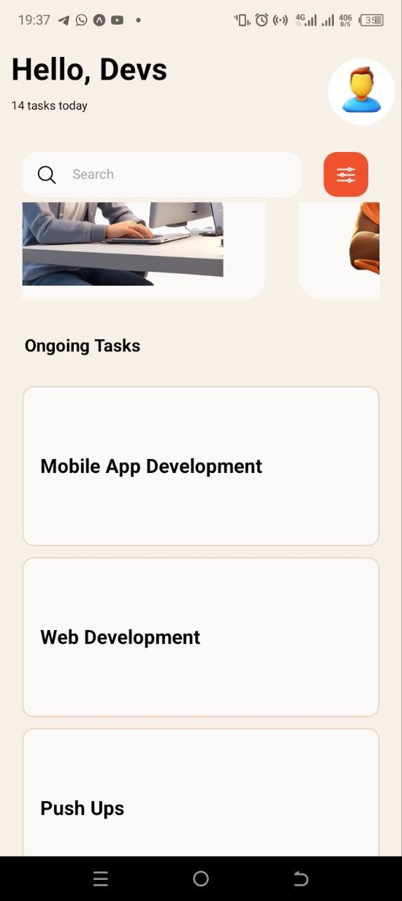
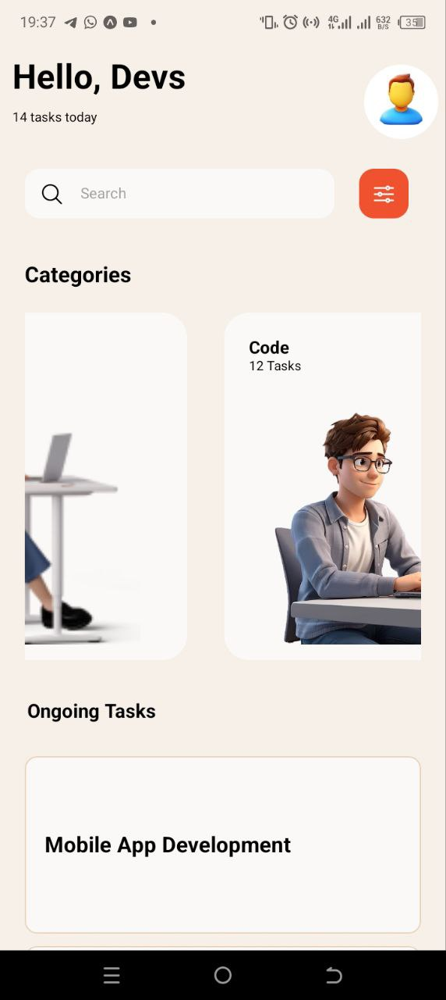
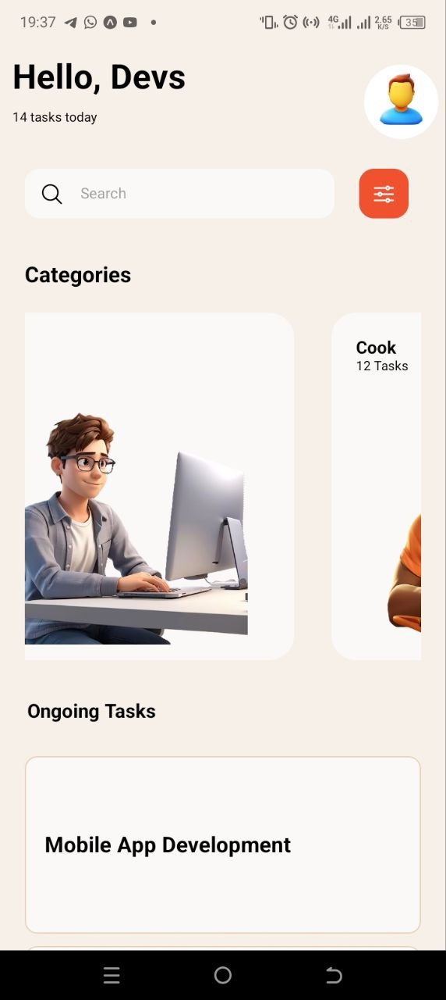
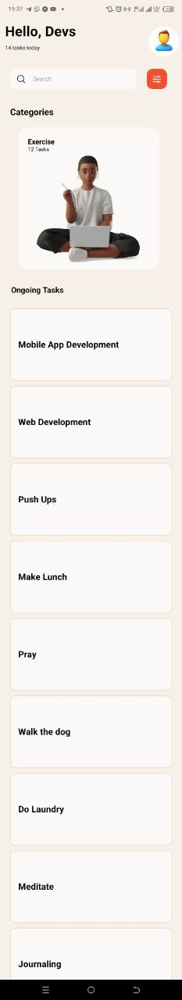
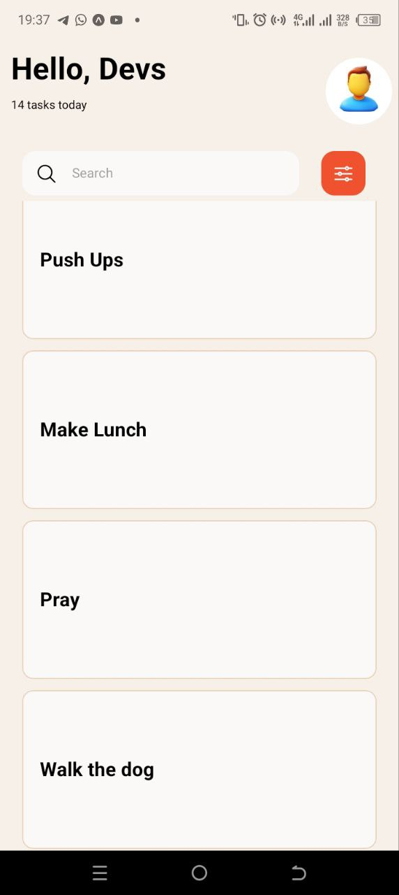
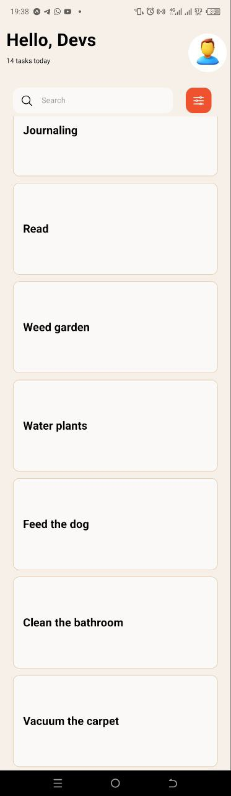
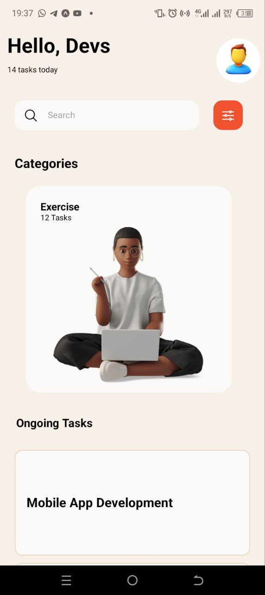
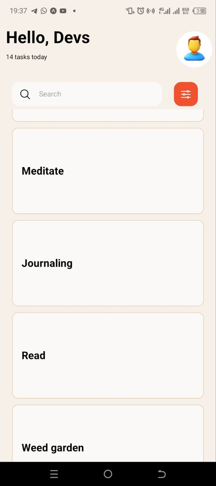

# Assignment 3

## View

The view component was used to create containers for other components of the application such as text and images

## Text

Was used to display text on the screen

## ScrollView

Was used to enable horizontal scrolling in the 'Categories' section of the app

## TextInput

Was used to render a search field on the screen

## Stylesheet

Multiple stylesheets were used to control the appearance of various elements displayed

## Button

The custom component 'TouchableOpacity' was used instead for easier customisation

## TouchableOpacity

Was used to render search and filter icons as buttons

## FlatList

Was used to render 'Ongoing Tasks' as a scrollable list.
Was also used to wrap the 'Categories' container to make it scrollable. (Ie. the container, not it's contents.)

## Image

Was used to display the profile image

## Icon

Was used to display the search and filter icons

## SafeAreaView

A custom safeAreaView component was used to unsure that all content was properly displayed on both Android and IOS devices

## Screenshots

